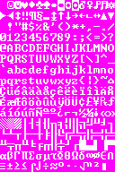
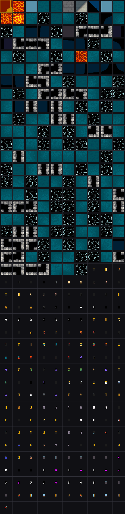
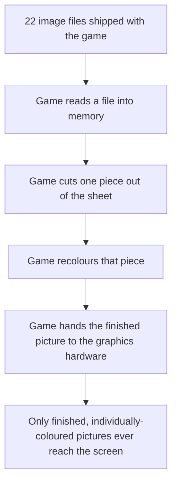
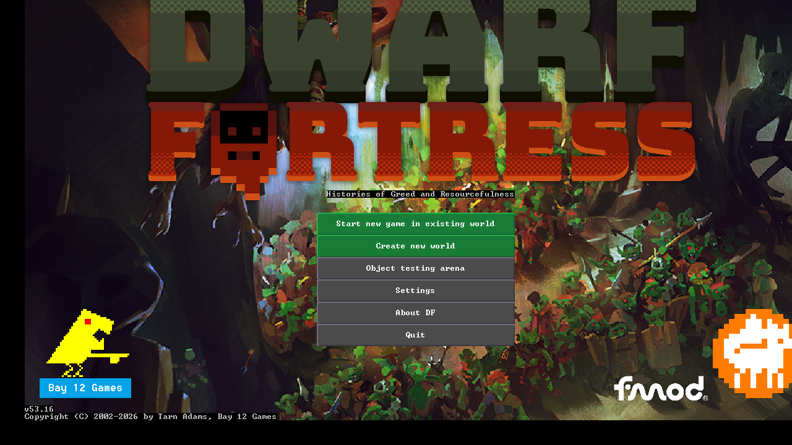
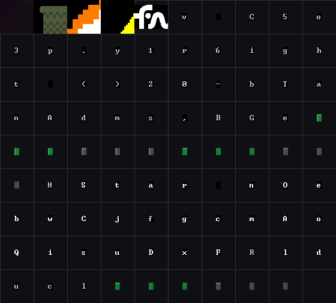
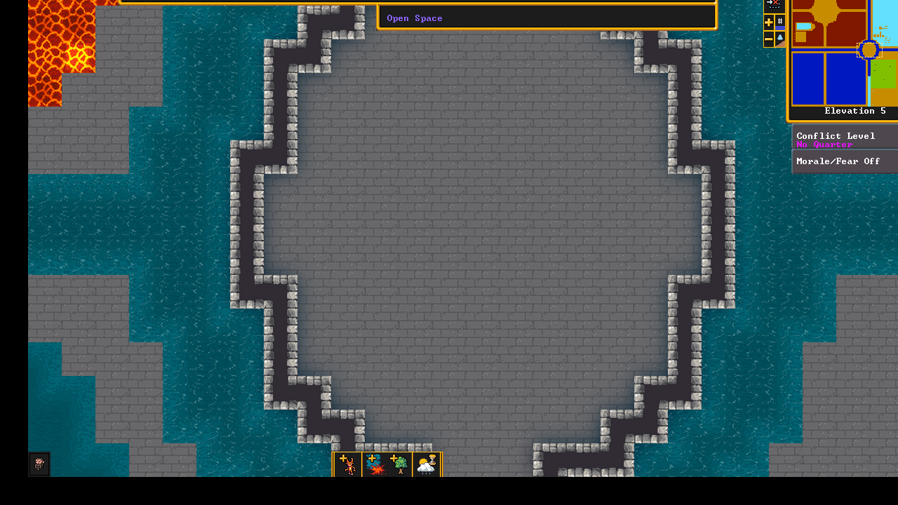
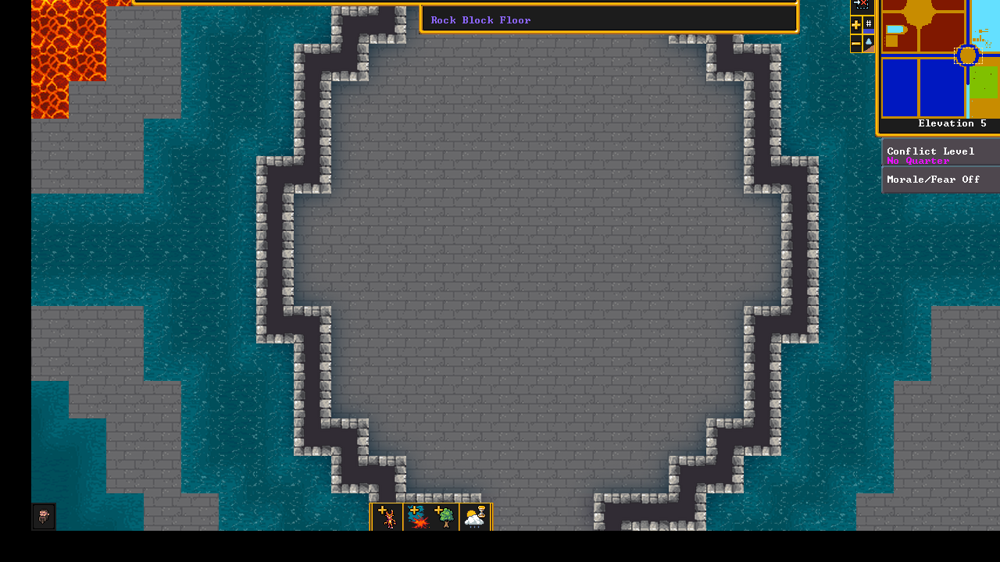
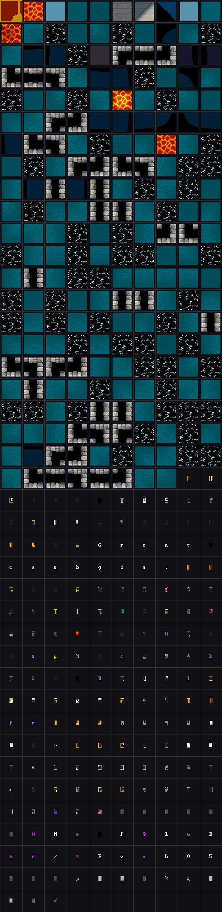
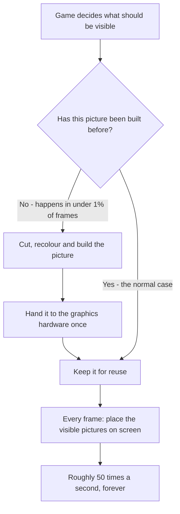

# How Dwarf Fortress puts pictures on the screen

Three questions were asked about what the game itself does, between its own
logic and the screen. Each is answered below with the game's own output as
evidence.

---

## Question 1 — Does it send sprites that are already in the PNG assets folder?

**No. The PNG files are raw material. The game cuts them up and rebuilds them,
and what reaches the screen is the rebuilt version, not the file.**

The game ships **22 PNG files**. Over one session it created **1,041 separate
sprites** from them. That gap is the whole answer: you cannot get a thousand
pictures out of twenty-two files without doing work on them.

Here is one of those files as it exists on disk. It is the font:



Every letter, digit and symbol the game can display is in that single small
image, laid out in a grid on a magenta background.

Here is what the game actually drew on screen while sitting in the arena — the
pictures it built and sent onward:



Read the lower half of that image and you can see individual characters —
`C r e a t u r e … t o   b e g i n` — which on screen form the message
"Create a creature to begin."

**Those single characters do not exist as files.** The game took the grid, cut
one character out at a time, recoloured it, and sent each as its own picture.
The magenta backing is gone because the game treated it as transparent.

The same is true of the terrain in the upper half of that image — water, lava,
masonry and floor, all cut into separate square pictures.



The recolouring is why the game must rebuild rather than reuse the file. The
same shape is needed in several colours, and the game never tints at the moment
of drawing — it bakes the colour into the picture first. Across a session it
recoloured pictures **2,072 times**, and those collapse to just **five colours**:
unmodified, a dimmed grey, a magenta highlight, a purple, and black. Everything
else on screen is one of those five applied to a shape.

**So: the screen shows rebuilt pictures, not the PNG files.**

---

## Question 2 — Does it only send sprites that are in the current view?

**Yes. The game sends only what is on screen, and the set changes the moment the
view moves.**

### Two different screens share almost nothing

The title screen and the arena, compared by the pictures each one drew:

| | Title screen | Arena |
| :--- | --: | --: |
| pictures drawn | 89 | 401 |
| pictures in common | **1** | **1** |

Out of 89 pictures on the title screen and 401 in the arena, exactly **one**
appears in both. Nothing from the arena's landscape exists on the title screen,
and none of the title screen's artwork survives into the arena.

Title screen, and the pictures it drew:





Arena screen, and the pictures it drew:




The title screen's pictures are almost entirely characters and a few logo
fragments. The arena's are terrain squares plus characters. They are different
worlds, and the game draws accordingly.

### Scrolling the view changes the set, piece by piece

Same arena, same session, same elevation — only the view scrolled sideways.

After scrolling, and the pictures it drew:





| | Before scrolling | After scrolling |
| :--- | --: | --: |
| pictures drawn | 401 | 403 |
| pictures in common | **332** | |
| stopped being drawn | **69** | |
| started being drawn | | **71** |
| still drawn, but moved | **61** | |

This is the exact fingerprint of drawing only what is visible:

- **69 pictures stopped being drawn** — that terrain scrolled off the edge
- **71 pictures started being drawn** — new terrain came into view
- **61 pictures stayed but moved** — still visible, now at new positions

The game does not redraw the whole map each time. It draws what is in front of
you, and when you scroll, the list of pictures changes to match.

**So: yes — only what is currently on screen.**

---

## Question 3 — How often does it send sprites?

**Building pictures and drawing them happen at completely different rates.**

Building is rare and comes in sudden bursts. Over a session of **6,025 frames**,
the game built pictures on only **63 of them — about one percent**:

```
frame 2474  ████████████████████████████████████████  81,547 pieces built
frame 2477  ███████████████████████                   47,241
frame 2471  █████████████                             27,058
frame 2478  ████████████                              25,008
frame 2469  ████████                                  17,375
frame    0  ███                                        6,275   game start-up
frame    1  ▏                                            586

half of all building is finished by frame 2474
almost all of it is finished by frame 2478
```

Those big bursts line up with loading. The one at frame 0 is the game starting
up and preparing the title screen. The one at frames 2469–2478 is the arena
being created — the game prepares every piece of terrain it might need, all at
once, before showing it to you.

Drawing, by contrast, happens constantly:



A frame in the arena places about **2,300 pictures**. That happens roughly 50
times every second — so around **115,000 placements per second** — while building
essentially never happens once an area has loaded.

**So: pictures are built rarely, in bursts when an area loads; they are placed on
screen constantly, every frame.**

---

## In one line each

1. **Not the PNGs** — the game cuts, recolours and rebuilds them; what you see is
   the rebuilt version.
2. **Yes, only the current view** — two screens share 1 picture in 89 and 401;
   scrolling swaps out 69 and brings in 71.
3. **Built rarely in bursts, drawn constantly** — building happens in about 1% of
   frames; placing pictures on screen happens ~50 times a second.
