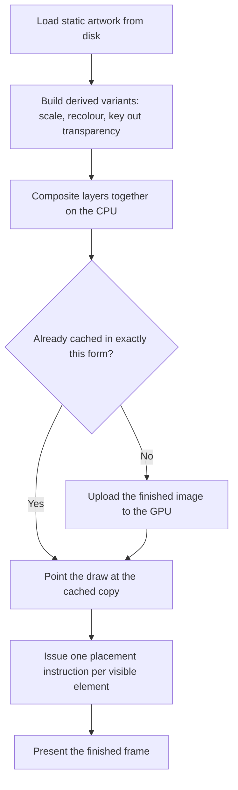

# PLAN — Reconstructing Dwarf Fortress's graphics pipeline as a DAG

**Goal:** assemble a verified model of how DF turns static PNG art into on-screen
pixels — where the CPU/GPU boundary sits, when and why it builds derived sprites
instead of referencing a sheet, and what the results look like.

Captured images are **intermediate verification**, not the deliverable. The
deliverable is the DAG in §3 with an evidence citation on every edge.

> Note: `plan.md` at the repo root is the source of truth for the streaming
> system and is untouched. This file is the DF-internals investigation plan.

---

## 1. Why not "just capture screenshots"

Six specific artefacts are required. Each is a claim that must be backed by
observation, not inference:

| # | Claim to establish | Evidence that settles it | Status |
|---|---|---|---|
| 1 | Which on-disk assets DF reads | Exact paths + dimensions, observed at load | ✅ 23 files from `data/art/` |
| 2 | Which call sites carry the graphics | Symbol + **caller identity**, fired live | ✅ caller = `libg_src_lib.so` |
| 3 | What the sprites actually are | Viewable pixels matching on-screen art | ⚠️ font glyphs only so far |
| 4 | What a draw instruction contains | Real, timestamped, decoded instructions | ⚠️ title screen only |
| 5 | Whether emission is viewport-driven | New uploads appearing as new area scrolls in | ❌ untested in gameplay |
| 6 | How often emission happens | Rate of uploads and draws over time | ⚠️ title screen only |

Items 3–6 all require **gameplay state** (the Object testing arena). That is the
single blocker.

---

## 2. Architecture — established by static analysis, not assumption

### 2.1 The game binary is not the renderer

`dwarfort` imports only ten SDL/IMG symbols, and **none** of the rendering calls:

```
IMG_Load  SDL_CreateRGBSurfaceFrom  SDL_FreeSurface  SDL_GetDisplayMode
SDL_GetNumDisplayModes  SDL_LockSurface  SDL_RWFromFile  SDL_SaveBMP_RW
SDL_UnlockSurface  SDL_UpperBlit
```

Two independent observations place the real renderer in `libg_src_lib.so`:

1. `dladdr` attribution from a preloaded hook:
   `CALLER SDL_RenderCopy <- ./libg_src_lib.so`
2. A DF crash backtrace:
   `dwarfort()` → `libg_src_lib.so main()` → `enabler::loop` →
   `enabler::eventLoop_SDL` → `SDL_PollEvent`

**Consequence:** any analysis that assumes the game binary issues draw calls is
working from a false premise.

### 2.2 The engine's graphics API surface

`libg_src_lib.so` links **libSDL2 + SDL2_image only** — no SDL3, no direct
OpenGL. Everything reaches the GPU through SDL2's renderer.

**Consumes (imports):**

| Category | Symbols | Meaning |
|---|---|---|
| Asset load | `IMG_Load` | PNG decode |
| Upload | `SDL_CreateTextureFromSurface`, `SDL_CreateTexture` | two upload paths |
| **CPU compositing** | `SDL_UpperBlit`, `SDL_FillRect`, `SDL_LockSurface`, `SDL_UnlockSurface`, `SDL_ConvertSurface`, `SDL_ConvertSurfaceFormat`, `SDL_CreateRGBSurface` | software composition |
| **Derivation / tint** | `SDL_SetSurfaceColorMod`, `SDL_SetSurfaceAlphaMod`, `SDL_SetTextureAlphaMod`, `SDL_SetColorKey`, `SDL_MapRGB`, `SDL_GetRGBA` | recolour, key, blend |
| Draw | `SDL_RenderClear`, `SDL_RenderCopy`, `SDL_RenderPresent` | GPU draw |
| Layout | `SDL_RenderSetLogicalSize`, `SDL_RenderWindowToLogical` | logical→physical scaling |
| Lifecycle | `SDL_DestroyTexture` | teardown |

Note there is **no `SDL_RenderCopyEx`** — rotation/flip is not used.

**Exposes (exports):**

```
render_things()                             the draw pass
hooks_prerender()                           pre-render hook
renderer_2d_base::update_all()              full repaint
renderer_2d_base::update_tile(int,int)      per-tile refresh
renderer_2d_base::grid_resize(int,int)      grid geometry change
renderer_2d_base::init_video(int,int)       video init
renderer_2d_base::get_renderer()/get_window()
cached_texturest::get_texture()             THE TEXTURE CACHE
cached_texturest::cached_texturest(SDL_Surface*)
init_fontst::create_derived_font_textures() font variants
SDL_Resize(SDL_Surface*, float, bool, int)  DF's own surface scaler
draw_nineslice / draw_horizontal_nineslice  UI chrome
viewscreenst::render(unsigned int)          screen dispatcher
```

**`cached_texturest` is the answer to the "dynamic vs static sprite" question** —
it is where DF decides to reuse an already-uploaded form or build a new one.

### 2.3 Observational support

From DF's own stdout at 1280×800: `Font size: 8x12` and
`Resizing grid to 160x66` — an 8×12 cell grid, 160×66 cells.

Measured with the probe at the title screen:

| Quantity | Value |
|---|---|
| PNGs read | 23, between 0.066 s and 0.233 s |
| Textures created | 106, all 8×12, all `<runtime>` (none from a PNG) |
| Creation window | 0.578 s → 0.600 s (**22.7 ms burst**) |
| Uploads after t=2 s | **0** |
| Draw calls | 2.7 M over 40 s |
| Frames | 2 540 ≈ 50 fps, ≈ 937 draws/frame |
| Cached sprite sheets on disk | 7 `_graphics` packs, `DISPLAYED_VERSION 53.16` |

**Unresolved:** DF read 23 PNGs but uploaded **zero** through
`SDL_CreateTextureFromSurface`. The title artwork therefore reaches the GPU by
another route — most likely `SDL_UpperBlit` into a composed surface, then
`SDL_CreateTexture`. Confirming this is a Phase 2 objective, not an assumption.

---

## 3. The DAG (target)



Each edge gets a citation once observed. The **B → D** edge is the core
hypothesis: derived forms are required, and the cache exists to avoid rebuilding
them per frame.

---

## 4. Hook-point inventory and selection

Interposition works when the callee lives in a **different** shared object from
the caller. That rule drives the whole selection.

| Tier | Hook | Why it is reachable | Data | Cost |
|---|---|---|---|---|
| Asset | `IMG_Load` | in libSDL2_image; fired 23× | source path, w×h | trivial |
| Derivation | `SDL_Resize` (DF's) | exported; called cross-object | surface + scale → **derived-sprite event** | trivial |
| Derivation | `SDL_SetSurfaceColorMod`, `SDL_SetColorKey`, `SDL_SetSurfaceAlphaMod` | in libSDL2 | the recolour applied | trivial |
| CPU compose | `SDL_UpperBlit` | in libSDL2 | src/dst surfaces + rects → **sprite transform** | low |
| Cache | `cached_texturest::get_texture()` | exported; needs `dlsym`, not interposition | key→texture, hit/miss | medium |
| Upload | `SDL_CreateTextureFromSurface`, `SDL_CreateTexture` | in libSDL2; first fired 103× | **pixels**, w×h, pitch | low |
| Per-tile | `renderer_2d_base::update_tile` | exported; needs `dlsym` | tile coords → **viewport signal** | medium |
| Draw | `SDL_RenderCopy` | in libSDL2; fired 2.7 M× | texture id + src/dst rect | low |
| Frame | `SDL_RenderPresent` | in libSDL2; fired 2 540× | frame boundary + time | trivial |
| Memory | `renderer_2d_base` via `get_renderer()` vtable | repo already walks this (`+0x60`, vtable[16]) | live renderer state | high |

**Selected set (three questions, three tiers):**

- *What artwork exists?* → `IMG_Load`
- *When and why is a derived form built?* → `SDL_Resize`, colour-mods, `SDL_UpperBlit`
- *What reaches the GPU, and when?* → `SDL_CreateTextureFromSurface`,
  `SDL_CreateTexture`, `SDL_RenderCopy`, `SDL_RenderPresent`

DF-internal functions are reached by `dlsym` (they are exported) rather than
interposition, since same-object calls cannot be intercepted.

Memory inspection is real and already demonstrated in this repo, but it is the
highest cost and lowest certainty — it stays a fallback.

---

## 5. Execution plan

### Phase 1 — Reach the arena
Input must be delivered with the pointer **inside** the window, because with no
window manager X focus is `PointerRoot`. Documented at
`scripts/qa_parity_walk.mjs:284`.

1. Move pointer into the DF window, allow focus to settle.
2. Click, then **screenshot and assert the pixels changed** before proceeding.
3. Targets located by colour from a live screenshot, never hardcoded — the
   published `createArena` coordinate is already known to be wrong at this
   resolution (measured 991,753 vs documented 991,678).

**Success:** texture sizes diversify beyond 8×12 and upload count climbs past
~103. **On failure: stop and report.**

### Phase 2 — Instrument and capture gameplay
Add the derivation and compose hooks. Resolve the open question in §2.3 — how
PNG art actually reaches the GPU — and pair each uploaded sprite with the PNG
it derives from.

### Phase 3 — Causality experiments
- **Viewport test:** record 10 s idle, then pan the map. Do uploads appear
  mid-pan, or was everything front-loaded? This settles claim 5.
- **Derivation test:** correlate each `SDL_Resize` / colour-mod with the upload
  that follows it, producing a cited B → D edge.

### Phase 4 — Assemble
DAG with evidence per edge; sprite sheet beside intercepted pixels; decoded
instruction sample; emit-rate table.

---

## 6. Guardrails

**These exist because an earlier attempt wedged the host.** A probe constructor
called `system()` under `LD_PRELOAD`; the child inherited `LD_PRELOAD`, reloaded
the library, re-ran the constructor and forked again — a self-replicating fork
bomb that reached the systemd user-slice ceiling of **41,412 tasks** and made the
machine unable to fork.

| Control | Mechanism |
|---|---|
| No fork-capable API | Probe uses raw `open`/`write` only |
| Build gate | `probe_guard.sh` rejects `system`/`fork`/`exec`/`popen`/`clone` and requires the ceiling |
| Runtime ceiling | `setrlimit(RLIMIT_NPROC, 1024)` set first in the constructor |
| Bounded runs | `setsid` + `timeout -s KILL` on every launch |
| No runaway retries | One attempt per phase; report rather than grind |
| Host hygiene | Kill DF/Xvfb and verify task count after each run |

Verified: 300 forks under the protected probe produce **one** constructor call.
The guard correctly fails against the original defect.
