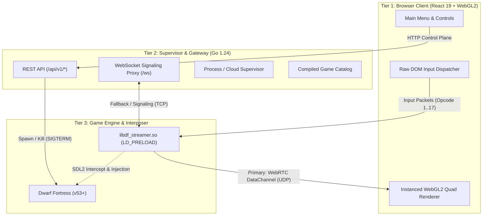

# Remote-DF

Low-latency web streaming system for Dwarf Fortress (and SDL2-based games). Delivers sub-15ms input-to-display latency using an LD_PRELOAD interposer hook, WebRTC unordered UDP DataChannels, and an instanced WebGL2 browser renderer.

---

## Architecture Overview



---

## The 3 Deployment Targets

The Go backend uses dependency injection at the composition root (`server/main.go`) to support three deployment targets without altering domain or streaming logic:

| Target | Description | Supervisor Adapter | Game Registry | Auth Mode | UI Serving |
| :--- | :--- | :--- | :--- | :--- | :--- |
| **1. Standalone Binary** | Single portable executable for local play | `ProcessSupervisor` (local `exec.Cmd`) | `CatalogRegistry` (local paths / `DF_DIR`) | Disabled (`authRequired=false`) | Embedded React SPA (`-tags embed_ui`) |
| **2. Self-Hosted Container** | Headless appliance (Docker/Podman) with Xvfb | `ProcessSupervisor` (container exec) | `CatalogRegistry` (`/game` volume mount) | Optional basic token | Bundled reverse proxy on `:8484` |
| **3. Centralised Hosting** | Multi-tenant cloud gaming platform | `CloudSupervisor` (Kubernetes Pods / APIs) | `DatabaseRegistry` (PostgreSQL / DynamoDB) | OAuth2 / JWT required | Separate CDN / S3 origin |

---

## Streaming & Protocol Architecture

1. **Transport**:
   * **Primary**: WebRTC DataChannel (`df-stream`), configured `ordered: false`, `maxRetransmits: 0` for true UDP non-blocking frame delivery.
   * **Signaling / Fallback**: WebSocket (`ws://host:8484/ws`), handles initial SDP negotiation, ICE candidates, and TCP streaming fallback.
2. **Wire Protocol**:
   * **Frame Header (`0xDF 0x53`)**: Sequence number (32-bit), width (16-bit), height (16-bit), command count (16-bit), flags (full=0x01, delta=0x02, debug stamp=0x04, combined delta=0x08).
   * **Draw Commands**: Instanced quad descriptors: `texId` (16-bit), `srcX/Y/W/H` (int16), `dstX/Y/W/H` (int16).
   * **Delta Compression**: Server maintains a 60-frame history ring buffer. Changes between consecutive frames are encoded as index-based delta updates compressed via ZSTD.
   * **Input Framing**: 16-byte fixed binary packets (opcodes: move=1, down=2, up=3, wheel=4, keydown=16, keyup=17).

---

## Codebase Organization

```
remote-df/
├── client/                     # Tier 1: Frontend SPA (React 19, Vite, Tailwind CSS)
│   ├── src/components/         # GameCanvas, MainMenu, StreamToast overlay
│   ├── src/core/               # renderer.js (WebGL2 instancing), protocol.js, input.js
│   └── src/api/                # Typed REST client for server endpoints
├── server/                     # Tier 2: Go Backend (Domain-Driven Vertical Slices)
│   ├── features/config/        # Server settings and capability flags
│   ├── features/games/         # Game catalog and install availability checks
│   ├── features/session/       # Process lifecycle (start, stop, status)
│   ├── domain/                 # Shared interfaces (*Registry, *Supervisor) & contracts
│   └── infrastructure/         # Web router, reverse proxy, logging
├── interposer/                 # Tier 3: C++ LD_PRELOAD Library
│   ├── df_streamer.cpp         # SDL2 symbol interception, WebRTC/libdatachannel, ZSTD delta encoder
│   ├── ws_server.hpp           # Embedded TCP WebSocket signaling server
│   └── Makefile                # Builds libdf_streamer.so
├── deployment/                 # Deployment configurations & integration test suites
│   ├── docker/                 # Container Dockerfiles & docker-compose setups
│   └── tests/                  # Container lifecycle and process cleanup shell suites
├── docs/                       # Architectural specs and technical audits
│   ├── system-design.md        # Full 3-tier contracts, layer boundaries, and DI architecture
│   ├── architecture-guidelines.md # Vertical slice rules and architectural guardrails
│   ├── stream_quality_benchmark_spec.md # Spec v2.0 benchmark framework and gates
│   └── qa_steam_graphics_issues.md # Steam Graphics QA audit, root causes, and repro scripts
└── tests/                      # Automated E2E and benchmark test suites
    ├── bench_stream_quality.mjs # Comprehensive Spec v2.0 benchmark suite
    ├── bench_suite_ascii_vs_graphics.mjs # Automated ASCII vs Graphics comparative benchmark
    └── repro_*.mjs             # Standalone issue reproduction scripts
```

---

## Build & Run Runbook

### 1. Build C++ Interposer
Requires `g++`, `libdatachannel-dev`, `libzstd-dev`, `libssl-dev`:
```bash
cd interposer
make
# Outputs libdf_streamer.so
```

### 2. Build Frontend Client
```bash
cd client
npm install
npm run build
# Outputs client/dist
```

### 3. Build Go Server
```bash
cd server
go build -o server .
# With embedded UI:
go build -tags embed_ui -o server .
```

### 4. Run Self-Hosted Container
```bash
cd deployment/docker
docker compose up -d
# Connect to http://localhost:8484
```

### 5. Run Quality Benchmark Suite
```bash
node tests/bench_stream_quality.mjs http://<host>:8484/df
```

---

## Documentation Index

* [System Design & Layer Contracts](docs/system-design.md) — Tier boundaries, wire formats, streaming transports, and DI details.
* [Architecture Guidelines](docs/architecture-guidelines.md) — Slice rules, domain package constraints, and test guardrails.
* [Stream Quality Benchmark Spec v2.0](docs/stream_quality_benchmark_spec.md) — Performance criteria, telemetry mathematics, and quality gates.
* [Steam Graphics QA Audit](docs/qa_steam_graphics_issues.md) — Full root-cause analysis, proof artifacts, and reproduction scripts for graphics regressions.
* [REST API Specification](openapi.yml) — OpenAPI 3.0 / Swagger schema for control plane endpoints.
