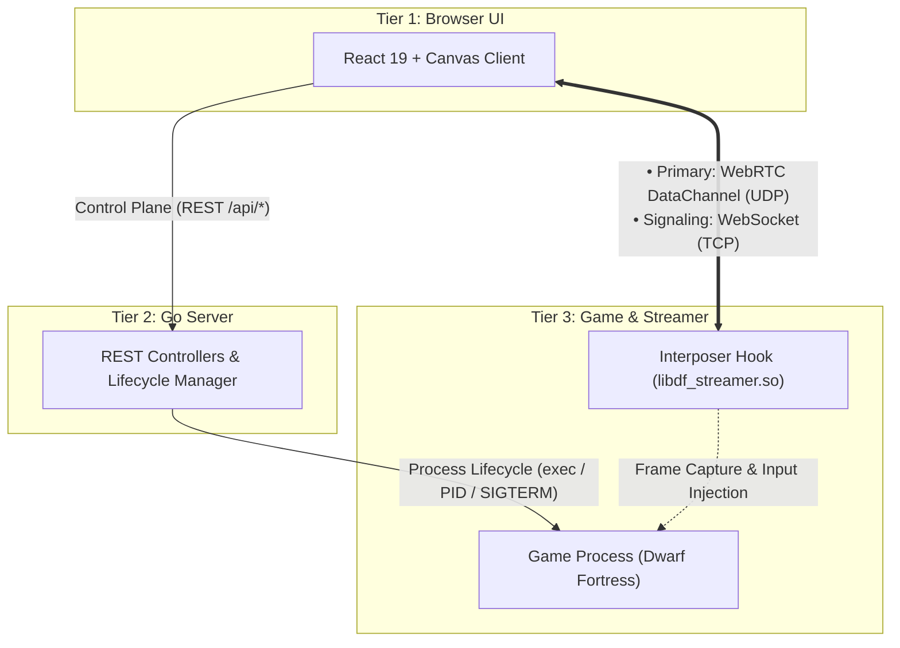
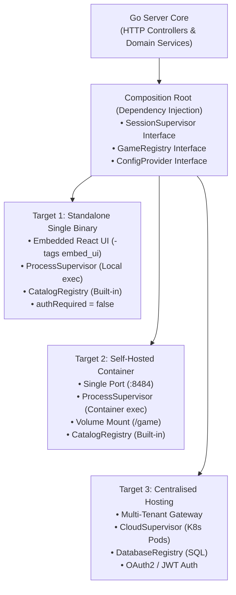

# System Design & Layer Contracts

This document specifies the end-to-end architecture, tier boundaries, wire contracts, streaming transports, and deployment flexibility for Remote-DF.

---

## 1. The 3-Tier Architecture

The system is strictly divided into three decoupled tiers:



---

## 2. Layer Contracts & Boundaries

| Boundary | Parties | Contract Format | Primary Artifact |
| :--- | :--- | :--- | :--- |
| **Control Plane** | Tier 1 (Browser) $\longleftrightarrow$ Tier 2 (Go Server) | JSON REST API | [`openapi.yml`](../openapi.yml) (Swagger 2.0 / OpenAPI 3.0) |
| **Stream Wire** | Tier 1 (Browser) $\longleftrightarrow$ Tier 3 (Interposer) | Binary Protocol over WebRTC / WS | Magic `0xDF`, zstd delta frames, 16-byte input structs |
| **Lifecycle** | Tier 2 (Go Server) $\longleftrightarrow$ Tier 3 (Game Process) | Catalog & OS Process API | [`DefaultGameCatalog`](../server/features/games/catalog.go), `exec.Cmd`, PID tracking |

---

## 3. Streaming Transport: UDP vs TCP

For real-time interactive game rendering, TCP exhibits Head-of-Line (HoL) blocking (a single dropped packet stalls all successive video frames).

Remote-DF uses a hybrid transport architecture:
1. **Primary Transport — WebRTC DataChannel (UDP)**:
   - Configured with `ordered: false` and `maxRetransmits: 0`.
   - Packets drop gracefully without stalling the rendering loop.
   - Yields $<8\text{ms}$ motion-to-photon latency.
2. **Signaling & Fallback — WebSocket (TCP)**:
   - Used for the initial $\sim 10\text{ms}$ WebRTC SDP offer/answer exchange and ICE candidate negotiation.
   - Acts as a fallback streaming transport only if UDP is explicitly blocked by network firewalls.

---

## 4. Built-in Game Catalog & Availability Checks

Supported games are defined in a compiled Go catalog (`DefaultGameCatalog`) rather than loose external JSON files, guaranteeing deterministic I/O and pre-wired streaming hooks:

```go
var DefaultGameCatalog = []GameDefinition{
    {
        ID:           "dwarf-fortress",
        Name:         "Dwarf Fortress",
        Description:  "The deepest, most intricate simulation of a world that's ever been created.",
        Engine:       "sdl2-opengl",
        RequiresXvfb: true,
        Tags: []domain.Tag{
            {Name: "Simulation", Level: "genre"},
            {Name: "Colony Sim", Level: "subgenre"},
        },
        SaveDirs:   []string{"data/save"},
        BinaryName: "dwarfort",
        DefaultDir: "/game",
        EnvKey:     "DF_DIR",
        PreloadLib: "/app/libdf_streamer.so",
    },
}
```

At runtime, `CatalogRegistry` checks if the binary exists in the configured install directory (`DF_DIR` or `/game`), setting `Available: true/false`. If the user has not mounted or provided the game files, the UI displays "Install Required".

---

## 5. Deployment Flexibility via Dependency Injection

The Go server core remains identical across all three deployment targets. Adapters are swapped at the composition root (`server/main.go`):



### Core Inversion Interfaces:
* **`SessionSupervisor`**:
  * Local/Container: `ProcessSupervisor` manages local Linux processes with `exec.Command`.
  * Centralised Hosting: `CloudSupervisor` delegates container lifecycle to Kubernetes Pods or cloud container APIs.
* **`GameRegistry`**:
  * Local/Container: `CatalogRegistry` evaluates built-in catalog against local install paths.
  * Centralised Hosting: `DatabaseRegistry` reads from PostgreSQL / DynamoDB.
* **`ConfigProvider`**:
  * Local/Container: `appConfigProvider` with `AuthRequired: false`.
  * Centralised Hosting: Managed Auth provider with `AuthRequired: true` and JWT validation.
